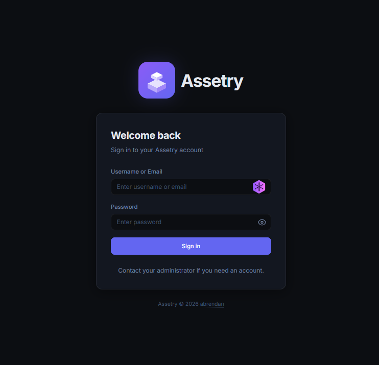
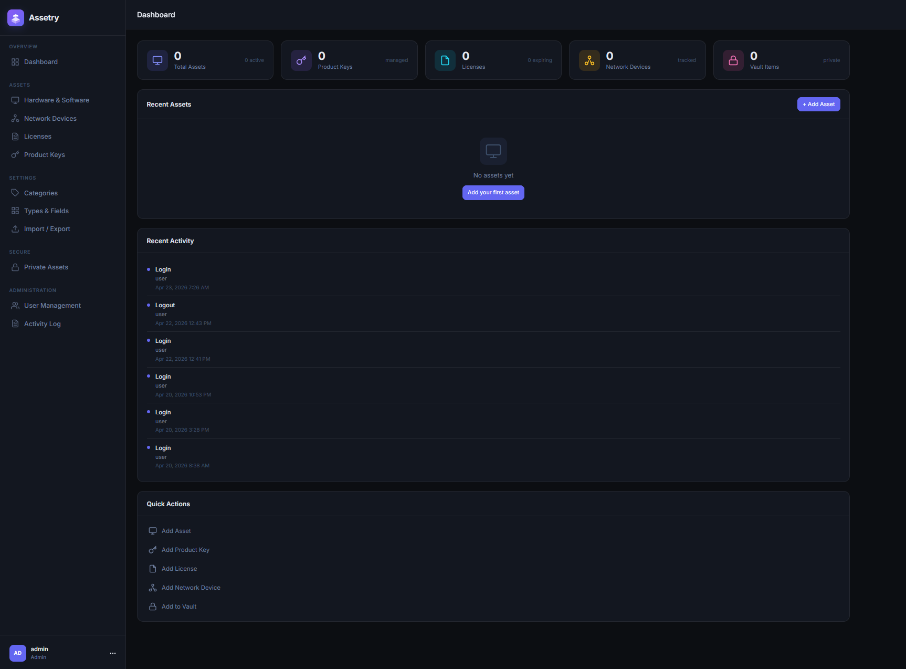

<div align="center">


# Assetry

**A modern, self-hosted IT asset management system.**

[](https://www.php.net/)
[](https://sqlite.org/)
[](#license)

A complete inventory platform for hardware, software keys, licenses, network gear, and sensitive credentials &mdash; built for small IT teams and homelabs that want full control of their data.

</div>

---

## Features

| | |
|---|---|
| **Asset Tracking** | Track hardware with custom types, images, serial numbers, warranty dates, and locations. |
| **Product Keys** | Store license keys with seat counts and per-device activation tracking. |
| **Licenses** | Manage software licenses, expiry dates, and assigned users. |
| **Private Vault** | Per-user encrypted vault for credentials, notes, and image attachments. |
| **Network Inventory** | Document switches, APs, IPs, MACs, and other infrastructure. |
| **Custom Categories** | Define your own asset types and personal categories. |
| **Multi-User** | Internal accounts with role-based access, activity logs, and admin tools. |
| **Import / Export** | CSV import and export for bulk migration and backups. |
| **Image Uploads** | Local image uploads for assets and vault items, with cover/gallery support. |
| **Modern Dark UI** | Clean, responsive interface designed for daily use. |

## Screenshots

<div align="center">




</div>

## Quick Start

### Using PHP's built-in server

```bash
php -S 0.0.0.0:3000 -t public public/index.php
```

Then open <http://localhost:3000> and sign in with the default admin account:

- **Username:** `admin`
- **Password:** `admin`

> Change the admin password immediately after first login.

### Using Apache or Docker

See [`DEPLOY.md`](DEPLOY.md) for full deployment instructions.

## Project Structure

```
.
├── public/             # Web root (index.php, static assets)
│   ├── index.php       # Application entrypoint
│   └── static/         # CSS, JS, logos
├── src/
│   ├── controllers/    # Route handlers (assets, keys, vault, etc.)
│   ├── views/          # PHP templates (layouts + pages)
│   ├── auth.php        # Sessions, CSRF, password hashing
│   ├── db.php          # SQLite schema + migrations
│   ├── helpers.php     # Image uploads, formatting, etc.
│   └── router.php      # Tiny custom router
└── data/
    ├── assetry.db      # SQLite database (default seed included)
    └── uploads/        # User-uploaded images (gitignored)
```

## Tech Stack

- **PHP 8.2** &mdash; no framework, just a small custom router
- **SQLite** &mdash; zero-config, single-file database
- **Vanilla CSS / JS** &mdash; no build step, no bundler
- **Apache / Docker / built-in server** compatible

## Default Credentials

The included database ships with a single admin user:

| Username | Password | Role |
|----------|----------|------|
| `admin`  | `admin`  | admin |

Resetting the database is as simple as deleting `data/assetry.db` &mdash; the app will recreate it with default seed data on the next request.

## License

MIT

---

<div align="center">


Crafted by [**abrendan**](https://www.abrendan.dev)

</div>
